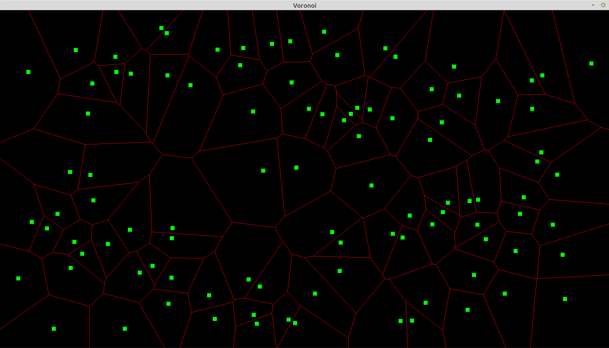

# Voronoi

*Drawing Voronoi diagrams*




## Installation

Only Linux (Ubuntu) is supported at this time.

* Installing the graphical library SDL2, and some FreeType fonts:

```
sudo apt install libsdl2-dev libsdl2-image-dev libsdl2-ttf-dev libfreetype6-dev
```


## Compilation

Compiling is done by running ``` make ```. Note that when modifying header files, ``` make clean ``` must be run beforehand.


## Runtime

```
./voronoi.exe
```


## Known issues

SDL2 v2.0.10 causes a drawing bug: rendering something changes the color of a specific pixel of the last drawn object. This bug however is not present in versions 2.0.8 and 2.0.14. Should it arise, uninstall the libsdl2-dev package, then install [this one](https://packages.debian.org/sid/libsdl2-2.0-0) and [this one.](https://packages.debian.org/source/sid/libsdl2) Finally, libsdl2-image-dev and libsdl2-ttf-dev may need to be updated after that.
